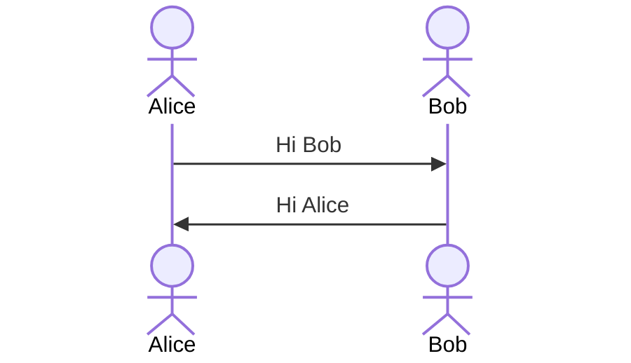

## Table of contents

- Project plan: [Plan](https://github.com/l2D/assignment-java-boot-camp/projects/1)
- Requirements:  [Wiki](https://github.com/l2D/assignment-java-boot-camp/wiki/Analyze-requirements)
- Workflow: [Wiki](https://github.com/l2D/assignment-java-boot-camp/wiki/Workflow)
- API Design: [Wiki](https://github.com/l2D/assignment-java-boot-camp/wiki/API-Routes)
- Test cases: [Wiki](https://github.com/l2D/assignment-java-boot-camp/wiki/Test-cases)

## For staff

- You can use Makefile to run the project.

#### Example:

- Clean, Test, and Package: `make check`
- Build docker image: `make build-docker`
- Clean, Test, Package and build docker image: `make check-and-build`
- Run docker image: `make run-image`
- (Optional) Kill port, if port is already in use: `make kill-port` (default kill port: 8080)
- Run all above flow: `make check-flow`

For more info: [Makefile](Makefile)

#### Project status: In progress 😥 (Hope not F)

## Assignments for Java Boot Camp
* [Week 1 :: Design and Develop RESTful API with Spring Boot](https://github.com/up1/assignment-java-boot-camp/wiki/Week-01)

## Resources
* [Spring Boot Reference](https://spring.io/projects/spring-boot)
* https://www.baeldung.com/ 
* https://start.spring.io/
* [Git commit message](https://www.conventionalcommits.org/en/v1.0.0/)

